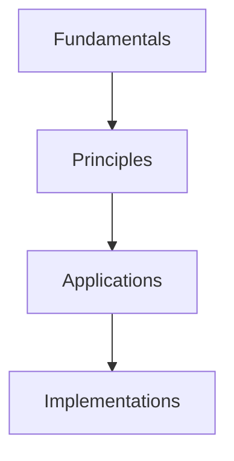

# Lesson 3: Key Concepts

## Fundamental Terminology

Before diving deeper into the subject matter, it's important to establish a shared understanding of the key terms and concepts that will be used throughout this course.

### Core Terms

1. **Fundamental Concept**: The most basic element of the subject area that all other concepts build upon.
2. **Principle**: A fundamental truth or proposition that serves as the foundation for a system of belief or behavior.
3. **Application**: The use of theoretical ideas in practical scenarios.
4. **Implementation**: The process of putting a decision or agreement into effect.

## Conceptual Framework

The conceptual framework of this subject area consists of interconnected layers:

Understanding these relationships is crucial for grasping advanced topics later in the course.

## Essential Principles

There are several essential principles that govern this field:

- **Modularity**: Breaking complex systems into discrete, understandable components
- **Abstraction**: Simplifying complex systems by focusing on high-level concepts
- **Iteration**: Repeatedly refining approaches based on outcomes and feedback
- **Scalability**: Designing solutions that can handle increased demand or complexity

## Building Blocks

These concepts form the building blocks for more advanced topics covered in Modules 2 and 3. Understanding them deeply will make subsequent learning more intuitive and effective.

Take the [Module 1 Quiz](../module-2-basics/lesson-3-quiz.md) to assess your understanding of these foundational concepts before continuing to [Module 2: Basics](../module-2-basics/lesson-1-foundations.md).